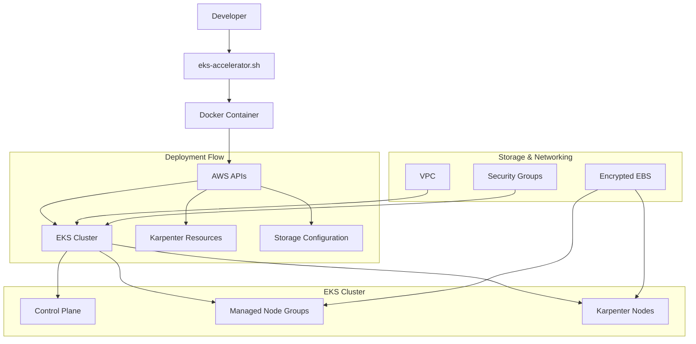

# Architecture Overview

## System Architecture

The EKS-Accelerator provides a comprehensive, automated solution for deploying production-ready Amazon EKS clusters with intelligent autoscaling via Karpenter. The architecture follows Infrastructure as Code principles with a simplified, unified deployment approach.

## High-Level Architecture



## Core Components

### 1. Containerized Deployment Environment

**Purpose**: Provides consistent, reproducible deployment environment

**Components**:

- **Alpine Linux 3.21**: Minimal, secure base image
- **kubectl v1.31.0**: Kubernetes cluster management
- **eksctl v0.210.0**: EKS cluster lifecycle management
- **Helm v3.16.4**: Kubernetes package management
- **AWS CLI v2**: AWS service integration

**Benefits**:

- Eliminates "works on my machine" issues
- Consistent tool versions across environments
- Isolated deployment environment
- Easy CI/CD integration

### 2. Infrastructure as Code (Unified Helm Chart)

**Purpose**: Simplified, declarative infrastructure management

**Structure**: Single `eks-complete` chart containing all resources

#### EKS Cluster Configuration
```yaml
apiVersion: eksctl.io/v1alpha5
kind: ClusterConfig
metadata:
  name: {{ .Values.clusterName }}
  region: {{ .Values.awsRegion }}
  version: {{ .Values.eksVersion }}
```

**Features**:

- Parameterized cluster configuration
- OIDC provider integration
- CloudWatch logging configuration
- VPC and networking setup
- AWS EBS CSI Driver addon

#### Karpenter NodePool (v1 API)
```yaml
apiVersion: karpenter.sh/v1
kind: NodePool
metadata:
  name: {{ .Values.clusterName }}-nodepool
```

**Features**:

- Spot and on-demand instance support
- Native EBS encryption (no CloudFormation needed)
- Flexible instance type selection
- Automatic consolidation policies

#### EC2NodeClass Configuration
```yaml
apiVersion: karpenter.k8s.aws/v1
kind: EC2NodeClass
metadata:
  name: {{ .Values.clusterName }}-nodeclass
```

**Features**:

- AMI selection with latest EKS-optimized images
- Built-in EBS encryption support
- Instance metadata security (IMDSv2)
- Subnet and security group discovery

### 3. Amazon EKS Cluster

**Purpose**: Managed Kubernetes control plane with worker nodes

**Configuration**:

- **Kubernetes Version**: 1.31
- **Control Plane**: Fully managed by AWS
- **Networking**: Custom VPC with public/private subnets
- **Authentication**: IAM and OIDC integration
- **Logging**: CloudWatch integration for audit and API logs

**Node Groups**:

- **Managed Node Group**: Initial capacity for system workloads
- **Karpenter Nodes**: Dynamic scaling based on workload demands

### 4. Karpenter Autoscaler

**Purpose**: Intelligent, fast node provisioning and scaling

**Architecture**:


**Features**:

- **Sub-minute provisioning**: Faster than traditional cluster autoscaler
- **Bin packing optimization**: Efficient resource utilization
- **Spot instance support**: Cost optimization
- **Custom launch templates**: Encrypted storage compliance
- **Automatic node termination**: Cost optimization through consolidation

### 5. Security Architecture

**Purpose**: Multi-layered security following AWS best practices

#### Network Security

- **VPC Isolation**: Dedicated VPC with controlled ingress/egress
- **Private Subnets**: Worker nodes in private subnets
- **Security Groups**: Granular network access control
- **NAT Gateway**: Secure outbound internet access

#### Encryption

- **EBS Encryption**: All persistent storage encrypted at rest
- **In-Transit**: TLS encryption for all API communications
- **Secrets Management**: AWS IAM and Kubernetes RBAC integration

#### Access Control

- **IAM Roles**: Service-specific IAM roles with minimal permissions
- **OIDC Provider**: Kubernetes service account to IAM role mapping
- **RBAC**: Kubernetes role-based access control

## Data Flow

### Deployment Flow

1. **Command Execution**: `./eks-accelerator.sh deploy --cluster-name <name>`
2. **Credential Validation**: Uses existing AWS CLI credentials
3. **Container Setup**: Docker image with deployment tools
4. **Template Rendering**: Unified Helm chart generates all resources
5. **EKS Creation**: eksctl provisions cluster infrastructure
6. **Add-on Installation**: AWS EBS CSI driver and Karpenter
7. **Resource Creation**: NodePool and EC2NodeClass for autoscaling
8. **Validation**: Health checks and readiness verification

### Runtime Flow

1. **Workload Deployment**: Users deploy applications to cluster
2. **Resource Monitoring**: Karpenter monitors unschedulable pods
3. **Node Provisioning**: Automatic EC2 instance provisioning
4. **Workload Scheduling**: Kubernetes schedules pods to nodes
5. **Scaling Optimization**: Continuous bin-packing and consolidation
6. **Cost Optimization**: Automatic node termination when unused

## Storage Architecture

### Storage Classes

```yaml
kind: StorageClass
apiVersion: storage.k8s.io/v1
metadata:
  name: gp3
provisioner: aws-ebs-csi-driver
parameters:
  type: gp3
  encrypted: "true"
```

**Features**:

- **GP3 volumes**: Latest generation EBS storage
- **Encryption**: Mandatory encryption for compliance
- **CSI driver**: Modern Kubernetes storage interface
- **Dynamic provisioning**: Automatic volume creation

### Volume Lifecycle

1. **PVC Creation**: Application requests persistent storage
2. **Volume Provisioning**: EBS CSI driver creates encrypted GP3 volume
3. **Attachment**: Volume attached to appropriate worker node
4. **Mount**: Volume mounted into pod container
5. **Cleanup**: Automatic volume deletion on PVC removal

## Monitoring and Observability

### CloudWatch Integration

- **Cluster Logs**: API server, audit, authenticator logs
- **Node Metrics**: CPU, memory, disk, network utilization
- **Application Logs**: Container stdout/stderr forwarding
- **Custom Metrics**: Application-specific metrics collection

### Karpenter Observability

```bash
kubectl logs -f -n karpenter -l app.kubernetes.io/name=karpenter
```

**Monitoring Points**:

- Node provisioning events
- Spot instance interruption handling
- Bin-packing decisions
- Cost optimization actions

## Scalability Characteristics

### Horizontal Scaling

- **Pod-level**: Kubernetes HPA/VPA for application scaling
- **Node-level**: Karpenter for infrastructure scaling
- **Cluster-level**: Multi-cluster architectures supported

### Performance Metrics

- **Node Provisioning**: < 60 seconds for new nodes
- **Pod Scheduling**: < 10 seconds for typical workloads
- **Cluster Size**: Supports 1000+ nodes per cluster
- **Workload Density**: 100+ pods per node depending on resources

### Cost Optimization

- **Spot Instances**: Up to 90% cost savings vs on-demand
- **Right-sizing**: Automatic instance type selection
- **Consolidation**: Automatic workload binpacking
- **Waste Reduction**: Immediate scale-down of unused capacity

## Integration Points

### AWS Services

- **EKS**: Managed Kubernetes control plane
- **EC2**: Worker node compute resources
- **EBS**: Persistent storage volumes
- **VPC**: Network isolation and routing
- **IAM**: Authentication and authorization
- **CloudFormation**: Infrastructure provisioning
- **CloudWatch**: Monitoring and logging

### External Integrations

- **Container Registries**: ECR, Docker Hub support
- **CI/CD Pipelines**: GitHub Actions, Jenkins integration
- **Monitoring Tools**: Prometheus, Grafana compatibility
- **Service Mesh**: Istio ready (optional)

## Design Principles

### 1. Infrastructure as Code
All infrastructure defined in version-controlled templates

### 2. Security by Default
Encryption, network isolation, and minimal permissions

### 3. Cost Optimization
Intelligent resource utilization and spot instance usage

### 4. Operational Simplicity
Automated deployment and management workflows

### 5. Scalability
Designed to handle production workloads at scale

### 6. Observability
Comprehensive logging and monitoring integration