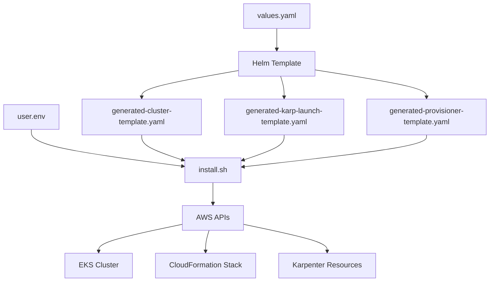

# Directory Structure

## Repository Overview

This document provides a comprehensive overview of the EKS-Accelerator repository structure, explaining the purpose and contents of each directory and file.

```
EKS-Accelerator/
├── README.md                         # Project overview and quick start
├── eks-accelerator.sh                # Unified deployment script
├── deployment.yaml                   # Karpenter testing deployment
├── docs/                            # Comprehensive documentation
│   ├── README.md                    # Documentation index
│   ├── architecture.md              # System architecture and design
│   ├── configuration.md             # Configuration reference
│   ├── deployment-guide.md          # Detailed deployment instructions
│   ├── directory-structure.md       # This file
│   ├── simplified-usage.md          # Guide for new simplified structure
│   └── troubleshooting.md           # Common issues and solutions
├── ci/                              # CI/CD and containerization
│   └── docker/                      # Docker configuration
│       ├── Dockerfile               # Multi-tool deployment container
│       ├── install.yaml             # Docker Compose for deployment
│       └── uninstall.yaml           # Docker Compose for cleanup
├── infrastructure/                   # Infrastructure as Code (Helm chart)
│   ├── Chart.yaml                   # Helm chart metadata
│   ├── values.yaml                  # All configuration values
│   └── templates/                   # Kubernetes and AWS resources
│       ├── _helpers.tpl             # Helm helper functions
│       ├── cluster.yaml             # eksctl ClusterConfig
│       ├── nodepool.yaml            # Karpenter NodePool (v1 API)
│       └── storageclass.yaml        # GP3 encrypted storage class
└── scripts/                         # Internal automation scripts
    ├── install.sh                   # Deployment automation (called by Docker)
    ├── uninstall.sh                 # Cleanup automation (called by Docker)
    └── user.env                     # Environment variables (generated at runtime)
```

## Root Directory Files

### `README.md`

**Purpose**: Project overview and quick start instructions

**Content**:

- Basic project description
- Quick installation steps
- Links to detailed documentation
- Command reference for common operations

### `create.sh`

**Purpose**: Interactive cluster deployment script

**Functionality**:

- Collects AWS credentials securely
- Validates user input (cluster name, region)
- Creates environment configuration file
- Builds deployment Docker image
- Initiates deployment via Docker Compose

**Key Features**:

- Secure credential handling (no echo)
- Input validation and sanitization
- Automatic environment file generation
- Error handling and user feedback

### `destroy.sh`

**Purpose**: Cluster cleanup and resource removal

**Functionality**:

- Collects cluster configuration
- Initiates cleanup via Docker Compose
- Removes all cluster-related resources

### `deployment.yaml`

**Purpose**: Karpenter functionality testing

**Content**:

- 50-pod stress testing deployment
- Resource requests to trigger autoscaling
- Alternative nginx deployment configuration
- Used for validating Karpenter behavior

## CI/CD Directory (`ci/`)

### `ci/docker/`

**Purpose**: Containerized deployment environment

#### `Dockerfile`

**Purpose**: Multi-tool container for EKS operations

**Base Image**: Alpine Linux 3.21

**Installed Tools**:

- **kubectl v1.31.0**: Kubernetes cluster management
- **eksctl v0.210.0**: EKS cluster lifecycle management  
- **Helm v3.16.4**: Kubernetes package management
- **AWS CLI v2**: AWS service integration
- **Python 3**: Scripting and AWS SDK support

**Key Features**:

- Minimal attack surface with Alpine base
- Latest security patches
- Consistent tool versions
- Optimized layer caching

**Directory Structure**:

```dockerfile
WORKDIR /work
ADD scripts ./scripts
ADD infrastructure ./infrastructure
COPY ["scripts/install.sh", "scripts/uninstall.sh", "scripts/user.env", "./"]
CMD ["bash", "scripts/install.sh"]
```

#### `install.yaml`

**Purpose**: Docker Compose service for deployment

```yaml
services:
  devsecops:
    command: ["bash", "scripts/install.sh"]
    image: devsecops:latest
```

**Features**:

- Uses locally built devsecops image
- Executes installation script
- Optional volume mounting for output

#### `uninstall.yaml`

**Purpose**: Docker Compose service for cleanup

```yaml
services:
  devsecops:
    command: ["bash", "scripts/uninstall.sh"]
    image: devsecops:latest
```

## Infrastructure Directory (`infrastructure/`)

### `infrastructure/eks-cluster/`

**Purpose**: EKS cluster Infrastructure as Code

#### `Chart.yaml`

```yaml
apiVersion: v2
name: eks-cluster
description: Helm Wrapper Chart for EKS Cluster Configuration with eksctl
type: application
version: 0.1.0
appVersion: 1.31.0
```

#### `values.yaml`

**Default Configuration**:

```yaml
awsRegion: "us-west-2"
clusterName: "devsecops-cluster"
eksVersion: "1.31"
nodeInstanceType: "t3.small"
vpc:
  cidr: 10.10.0.0/16
```

**Customizable Parameters**:

- AWS region and cluster name
- Kubernetes version
- Node instance types
- VPC CIDR configuration

#### `templates/cluster.yaml`

**Purpose**: eksctl ClusterConfig template

**Key Configuration Sections**:

1. **Metadata and Version**:

   ```yaml
   apiVersion: eksctl.io/v1alpha5
   kind: ClusterConfig
   metadata:
     name: {{ .Values.clusterName }}
     region: {{ .Values.awsRegion }}
     version: {{ .Values.eksVersion | quote }}
   ```

2. **IAM and OIDC**:

   ```yaml
   iam:
     withOIDC: true
   ```

3. **Add-ons Configuration**:

   ```yaml
   addons:
   - name: aws-ebs-csi-driver
     version: 1.44.0
     attachPolicy: [detailed IAM policy]
   ```

4. **VPC Configuration**:

   ```yaml
   vpc:
     cidr: {{ .Values.vpc.cidr }}
     clusterEndpoints:
       publicAccess: true
       privateAccess: true
   ```

5. **Managed Node Groups**:

   ```yaml
   managedNodeGroups:
     - name: managed-ng-private-1
       volumeType: gp3
       volumeEncrypted: true
       instanceType: {{ .Values.nodeInstanceType }}
       privateNetworking: true
   ```

6. **Karpenter Integration**:

   ```yaml
   karpenter:
     version: "1.0.0"
     createServiceAccount: true
   ```

#### `storageclass.yaml`

**Purpose**: Default encrypted storage configuration

```yaml
kind: StorageClass
apiVersion: storage.k8s.io/v1
metadata:
  name: gp3
  annotations:
    storageclass.kubernetes.io/is-default-class: "true"
provisioner: aws-ebs-csi-driver
volumeBindingMode: WaitForFirstConsumer
parameters:
  type: gp3
  encrypted: "true"
```

### `infrastructure/karpenter-launch-template/`

**Purpose**: Custom launch template for encrypted EBS volumes

#### `Chart.yaml`

```yaml
apiVersion: v2
name: karpenter-launch-template
description: Helm Wrapper Chart for AWS Karpenter launch template
type: application
version: 1.0.0
```

#### `templates/launch-template.yaml`

**Purpose**: CloudFormation template for EC2 launch template

**Key Components**:

1. **Multi-Region AMI Mappings**:

   ```yaml
   Mappings:
     AMIRegionMap:
       us-west-2:
         AMIID: ami-0a2ab2d6adf0cb47d
       us-east-1:
         AMIID: ami-01456a67b2a6b4cb1
       # ... additional regions
   ```

2. **Launch Template Resource**:

   ```yaml
   Resources:
     CustomKarpenterLaunchTemplate:
       Type: AWS::EC2::LaunchTemplate
       Properties:
         LaunchTemplateData:
           IamInstanceProfile:
             Name: eksctl-KarpenterNodeInstanceProfile-{{ .Values.clusterName }}
           ImageId: !FindInMap [AMIRegionMap, !Ref "Region", AMIID]
           BlockDeviceMappings:
             - DeviceName: /dev/xvda
               Ebs:
                 VolumeSize: "{{ .Values.volumeSize }}"
                 VolumeType: "{{ .Values.volumeType }}"
                 Encrypted: "{{ .Values.encrypted }}"
   ```

3. **Security Group Integration**:

   ```yaml
   SecurityGroupIds:
     - Fn::ImportValue: !Sub
         - "eksctl-${ClusterName}-cluster::SharedNodeSecurityGroup"
         - ClusterName: !Ref ClusterName
   ```

### `infrastructure/karpenter-provisioner/`

**Purpose**: Karpenter NodePool configuration

#### `Chart.yaml`

```yaml
apiVersion: v2
name: karpenter-provisioner
description: Helm Wrapper Chart for AWS Karpenter provisioner
type: application
version: 1.0.0
```

#### `templates/provisioner.yaml`

**Purpose**: Karpenter NodePool resource definition

```yaml
apiVersion: karpenter.sh/v1beta1
kind: NodePool
metadata:
  name: my-nodepool
spec:
  template:
    spec:
      providerConfig:
        launchTemplate:
          name: KarpenterCustomLaunchTemplate
      subnetSelector:
        kubernetes.io/role/internal-elb: '1'
      securityGroupSelector:
        karpenter.sh/discovery: {{ .Values.clusterName }}
      instanceProfile: eksctl-KarpenterNodeInstanceProfile-{{ .Values.clusterName }}
  constraints:
    - key: karpenter.sh/capacity-type
      operator: In
      values: [spot]
```

## Scripts Directory (`scripts/`)

### `install.sh`

**Purpose**: Complete deployment automation script

**Phases**:

1. **Environment Setup**:

   ```bash
   export EKS_DIR="infrastructure/eks-cluster"
   export KARP_LAUNCH_TEMPLATE="infrastructure/karpenter-launch-template"
   export PROV_DIR="infrastructure/karpenter-provisioner"
   source ${SCRIPTS_DIR}/user.env
   ```

2. **EKS Cluster Creation**:

   ```bash
   # Create service linked role
   aws iam create-service-linked-role --aws-service-name spot.amazonaws.com
   
   # Render and apply cluster template
   helm template eks-cluster ${EKS_DIR} > generated-cluster-template.yaml
   eksctl create cluster -f generated-cluster-template.yaml
   ```

3. **Storage Configuration**:

   ```bash
   kubectl apply -f ${EKS_DIR}/storageclass.yaml
   kubectl patch storageclass gp2 -p '{"metadata": {"annotations":{"storageclass.kubernetes.io/is-default-class":"false"}}}'
   ```

4. **Karpenter Setup**:

   ```bash
   # Deploy launch template
   helm template karpenter-launch-template ${KARP_LAUNCH_TEMPLATE} > generated-karp-launch-template.yaml
   aws cloudformation create-stack --stack-name KarpenterLaunchTemplateStack
   
   # Deploy provisioner
   helm template karpenter-provisioner ${PROV_DIR} > generated-provisioner-template.yaml
   kubectl apply -f generated-provisioner-template.yaml
   ```

### `uninstall.sh`

**Purpose**: Complete cleanup automation script

**Phases**:

1. **Workload Cleanup**:

   ```bash
   # Remove all deployments except system components
   deployments=$(kubectl get deployment --all-namespaces --no-headers | awk -F' ' '{print $1}' | grep -v 'kube-system\|karpenter')
   for each in $deployments; do
     kubectl delete deployments --namespace=$each --all
   done
   ```

2. **Node Cleanup**:

   ```bash
   # Terminate Karpenter-managed nodes
   karp_nodes=$(aws ec2 describe-instances --query "Reservations[*].Instances[*].InstanceId" --filters "Name=tag:karpenter.sh/provisioner-name,Values=*")
   aws ec2 terminate-instances --instance-ids $karp_nodes
   ```

3. **Infrastructure Cleanup**:

   ```bash
   # Remove CloudFormation stacks
   aws cloudformation delete-stack --stack-name KarpenterLaunchTemplateStack
   
   # Delete EKS cluster
   eksctl delete cluster --region ${AWS_REGION} --name ${CLUSTER_NAME}
   ```

4. **Network Cleanup**:

   ```bash
   # Clean up orphaned ENIs
   orphaned_eni_test=$(aws ec2 describe-network-interfaces --filters "Name=tag-key, Values=node.k8s.amazonaws.com/instance_id")
   for item in $orphaned_eni_test; do
     aws ec2 delete-network-interface --network-interface-id $item
   done
   ```

### Generated Files

#### `user.env`

**Purpose**: Runtime environment variables

**Generated by**: `create.sh` script

**Content**:

```bash
export AWS_ACCESS_KEY_ID="<user-input>"
export AWS_SECRET_ACCESS_KEY="<user-input>"
export AWS_SESSION_TOKEN="<user-input>"
export CLUSTER_NAME="<user-input>"
export AWS_REGION="<user-input>"
```

**Security**: Automatically deleted after use

#### `generated-cluster-template.yaml`

**Purpose**: Rendered eksctl configuration

**Generated by**: Helm template command

**Source**: `infrastructure/eks-cluster/templates/cluster.yaml`

#### `generated-karp-launch-template.yaml`

**Purpose**: Rendered CloudFormation template

**Generated by**: Helm template command

**Source**: `infrastructure/karpenter-launch-template/templates/launch-template.yaml`

#### `generated-provisioner-template.yaml`

**Purpose**: Rendered Karpenter NodePool

**Generated by**: Helm template command

**Source**: `infrastructure/karpenter-provisioner/templates/provisioner.yaml`

## File Relationships

### Template Generation Flow



### Dependencies

1. **create.sh** → **user.env** → **install.sh**
2. **Helm charts** → **generated templates** → **AWS resources**
3. **Docker container** → **deployment scripts** → **infrastructure**

## Customization Points

### Configuration Files

- `infrastructure/*/values.yaml`: Parameter customization
- `infrastructure/*/templates/*.yaml`: Template modification
- `ci/docker/Dockerfile`: Tool versions and container configuration

### Scripts

- `create.sh`: User interaction and validation
- `install.sh`: Deployment logic and sequencing
- `uninstall.sh`: Cleanup procedures

### Documentation

- `docs/`: Comprehensive documentation structure
- `README.md`: Quick reference and overview